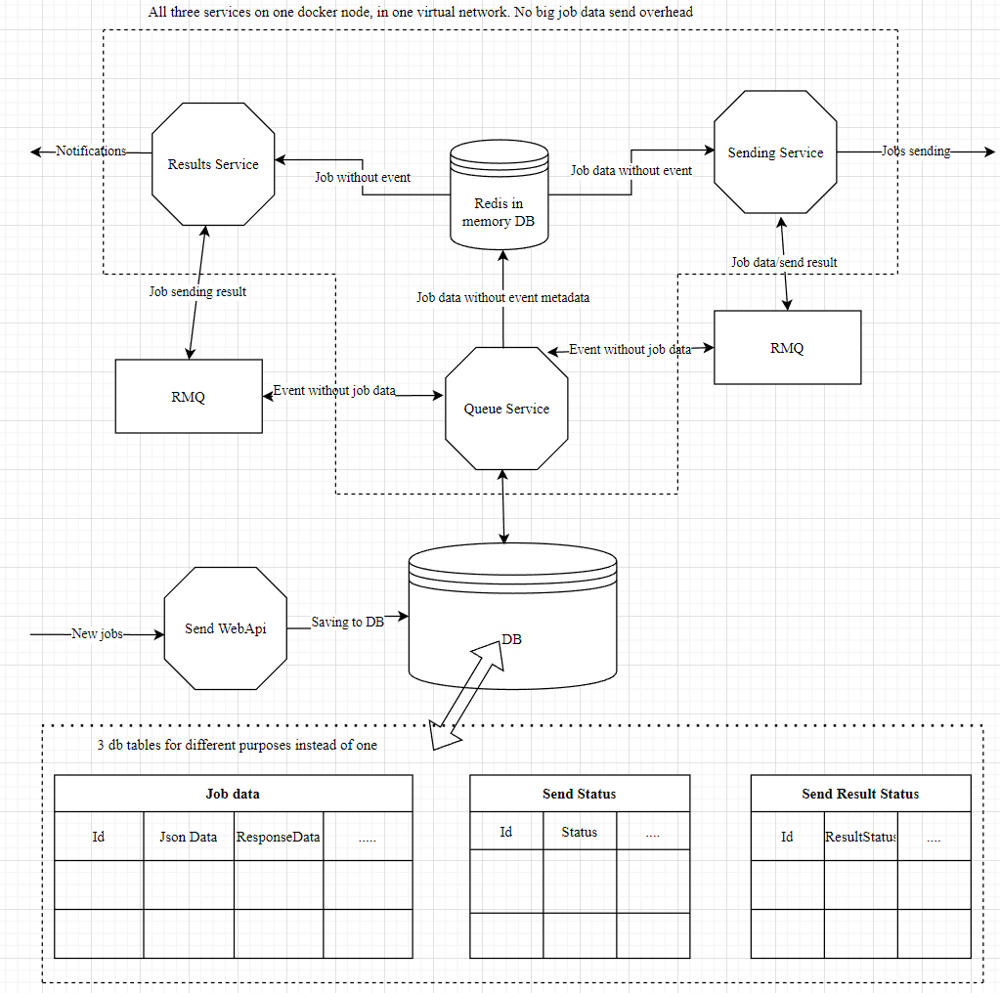

### Проект SendingScheduler

Представляет собой шедьюлер который может отправлять данные размерами не более 500 мб(ограничение Redis).

Версия среды: Core 6.0+

Зависит от нугета MassTransitRMQControllerExtensions.

P.S. Проект содержит в себе пример использования нугетов.


### План:



### Конфиг для нугетов:

```json
"Service": {
    "Id": 0, //id группы сабсервисов Sending отвечает за фильтрацию и обработку джобов с этим id. Обязателен для всех сабсервисов.
    "QueryBatchSize": 100, //размер выборки джобов по id из персистентного хранилища. Обязателен  только для сабсервиса Queue
    "MemoryCacheSlidingInMinutes": 30, //максимальное время жизни тело джоба с момента последнего обращения к нему
    // в inmemory кеше сервисов.  Обязателено для сабсервиса Queue и Sending
    "RetriesMaximum" :  3 //максимальное число попыток отправки данных/обработок результатов отправки после первой
    // Обязателено для сабсервиса Results и Sending
  },
  "ConnectionStrings": {
    "SendingDB": "*адрес персистентного хранилища данных джобов*",  // Обязателено для сабсервиса Queue
    "RedisMemoryCache": "*адрес межсервисного кеша Redis*"  //Обязателен для всех сабсервисов.
  },
  "Rabbit": { //Конфиг раббита. Обязателен для всех сабсервисов.
    "HostName": "*",
    "Port": *,
    "UserName": "*",
    "Password": "*"
  }
```

### План использования для сабсервиса  Results:

* Создать новый сервис.
* Добавить нугет SendingScheduler.Results
* В di проекта вызвать ConfigureSendingResultsService
* Сконфигурировать провайдер конфигураций для нугета.
* Создать контроллер(нейминг класса не имеет значения) и реализовать в нем опциональные хэндлеры результатов отправки. Для биндинга методов и типов джобов по operationType используется атрибут [OperationType(\*operationId\*)]

\+ метод обработки должен иметь один из суффиксов:

* HandleSuccess     (обработка результата успешной отправки)
* HandleInnerFailError  (обработка критической ошибки инфраструктуры)
* HandleLogicalReceiverError  (обработка логической ошибки отправки джоба)
* HandleRepeatingError (обработка временной ошибки отправки джоба)

Допустимые сигнатуры параметров методов смотриме в проекте Sending.Results.Example. Максимальное число параметров 3.

Имена параметров строго регламентированы(jobInfo, sendData, sendResponse, errorData). Минимальное число параметров 1(jobInfo типа JobInfo).


### План использования для сабсервиса  Sending:

* Создать новый сервис.
* Добавить нугет SendingScheduler.Send
* В di проекта вызвать ConfigureSendingSendService
* Сконфигурировать провайдер конфигураций для нугета.
* Создать контроллер(нейминг класса не имеет значения) и реализовать в нем по одному хэндлеру на один operationId. Для биндинга методов и типов джобов по operationType используется атрибут [OperationType(\*operationId\*)]

Хэндлер может получать на вход 1 параметр либо типа string либо кастомного типа в которое тело джоба будет автоматически десериализовано. Метод может возвращать результат обработки джоба который будет передан в сервис Results в качестве параметра sendResponse.


### План использования для сабсервиса  Queue:

* Создать новый сервис.
* Добавить нугет SendingScheduler.Queue
* В di проекта вызвать ConfigureSendingQueueService
* Сконфигурировать провайдер конфигураций для нугета.
* Реализовать интерфейс IJobsStore для работы с персистентным хранилищем


